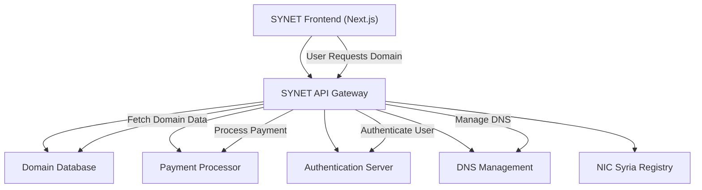
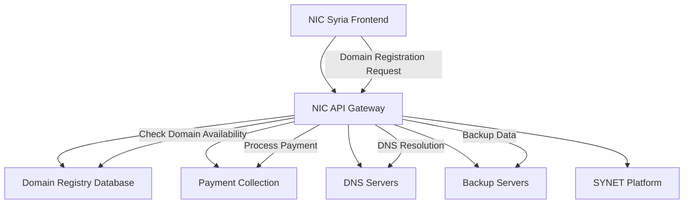

```mermaid 
graph TD;

    %% SYNET System Model
    A1["SYNET Frontend (Next.js)"] --> B1["SYNET API Gateway"];
    B1 --> C1["Domain Database"];
    B1 --> D1["Payment Processor"];
    B1 --> E1["Authentication Server"];
    B1 --> F1["DNS Management"];

    %% User Journey
    A1 -->|User Requests Domain| B1;
    B1 -->|Fetch Domain Data| C1;
    B1 -->|Process Payment| D1;
    B1 -->|Authenticate User| E1;
    B1 -->|Manage DNS| F1;
    
    %% External Interactions
    B1 --> G1["NIC Syria Registry"];

```	

```mermaid
graph TD;

    %% NIC Syria System Model
    A2["NIC Syria Frontend"] --> B2["NIC API Gateway"];
    B2 --> C2["Domain Registry Database"];
    B2 --> D2["Payment Collection"];
    B2 --> E2["DNS Servers"];
    B2 --> F2["Backup Servers"];

    %% Admin Journey
    A2 -->|Domain Registration Request| B2;
    B2 -->|Check Domain Availability| C2;
    B2 -->|Process Payment| D2;
    B2 -->|DNS Resolution| E2;
    B2 -->|Backup Data| F2;
    
    %% External Interaction
    B2 --> G2["SYNET Platform"];
```