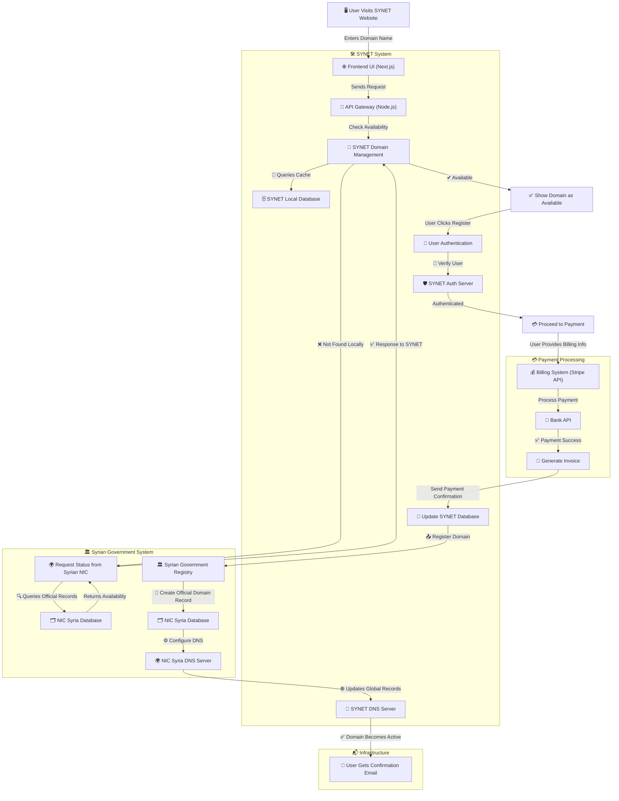
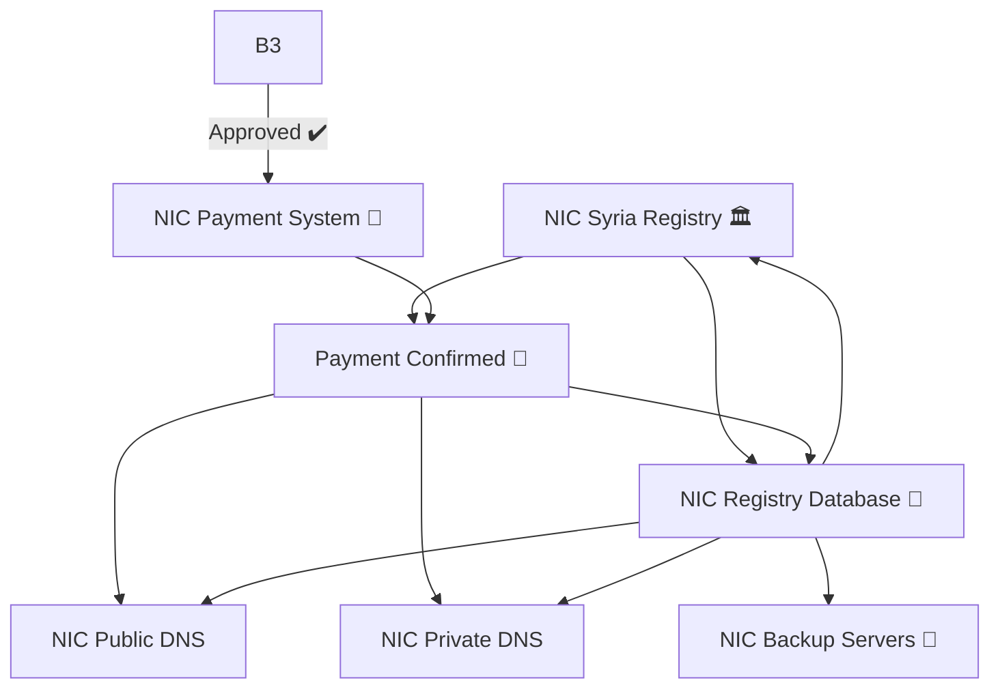

### 1. Domain Management System

The Domain Management System is responsible for handling domain availability checks, user authentication, and domain registration. It interacts with the Syrian NIC database to check domain availability and register domains. It also interacts with the SYNET database to store domain registration information.

### System components :

| **Component** | **Role in the System** |
|--------------|----------------|
| 🌐 **User** | The person registering a `.sy` domain. |
| 💻 **SYNET Frontend (Next.js)** | The user-facing website for domain registration. |
| 🔀 **SYNET API Gateway** | Handles requests and communication between frontend, database, and NIC Syria. |
| 🗄️ **SYNET Domain Database** | Stores cached domain data to reduce direct NIC Syria queries. |
| 🔐 **SYNET Authentication** | Verifies user identity before proceeding with purchases. |
| 💳 **SYNET Payment Processor** | Processes payments using Stripe, bank API, or other providers. |
| 🧾 **SYNET Invoice Generator** | Issues invoices for successful payments. |
| 🏛️ **NIC Syria Registry** | The official government entity managing `.sy` domains. |
| 📜 **NIC Registry Database** | Stores official `.sy` domain records. |
| 👨‍💼 **NIC Admin Review** | Government officials who manually review domain requests. |
| 🏦 **NIC Payment System** | Government's payment processing system for domain purchases. |
| 🌍 **NIC DNS Servers** | The authoritative DNS for `.sy` domains. |
| 🔄 **NIC Backup Servers** | Maintains a secondary copy of `.sy` registry data. |

---

### **Key Features**
✅ **Handles both SYNET and NIC Syria's systems.**  
✅ **Covers the full registration process from user entry to government approval.**  
✅ **Includes payment flow for both SYNET and NIC Syria.**  
✅ **Shows backup and DNS infrastructure for reliability.**  

---

### 2. SY gov system 

The Syrian government system is responsible for maintaining the official domain records and DNS configuration. It interacts with the NIC Syria database to create official domain records and the NIC Syria DNS server to configure DNS settings.

### **NIC Syria Infrastructure - Components with Price Estimates and Usage**

Here's a detailed table listing the required components for **NIC Syria**'s infrastructure along with estimated prices and their usage:

| **Component**                  | **Description**                                                                 | **Estimated Price (USD)**     | **Usage**                                 |
|---------------------------------|---------------------------------------------------------------------------------|-------------------------------|-------------------------------------------|
| **Web Servers**                 | Servers that handle domain registration and user interactions.                 | $3,000 (x2 servers)           | Hosting NIC’s public-facing applications |
| **Application Servers**         | Servers for domain registration processing and API handling.                   | $6,000 (x4 servers)           | Load balancing for API requests          |
| **Database Servers**            | Servers hosting the NIC registry database (PostgreSQL or MySQL).               | $8,000 (x2 servers)           | Store domain registration data           |
| **DNS Servers**                 | High-availability DNS servers for domain resolution.                           | $5,000 (x2 servers)           | Resolve queries for .sy domains          |
| **Backup Servers**              | Backup storage for registry data, DNS records, and system configuration.      | $4,000 (x2 servers)           | Ensure data redundancy and recovery      |
| **Networking Equipment**        | Routers, firewalls, and load balancers for network traffic management.         | $7,000 (network equipment)    | Manage traffic and secure communication  |
| **Security Appliances (IDS/IPS)** | Security devices to monitor and protect against cyber threats.                | $5,000 (x2 appliances)        | Protect against DDoS, intrusions, and attacks |
| **Load Balancers**              | Distribute traffic between servers to ensure efficient resource usage.        | $4,500 (x2 devices)           | Ensure high availability for services    |
| **VPN Access Solutions**        | Secure remote access for administrative use.                                  | $2,000 (VPN hardware/software) | Provide secure admin access              |
| **Payment Gateway Integration** | Integration for payment processing for domain registration fees.              | $3,000 (integrations + licenses) | Facilitate secure transactions           |
| **Domain Management Software**  | Software for managing domain registrations, renewals, and updates.             | $10,000 (custom software dev) | Manage domain registration and workflows |

---
