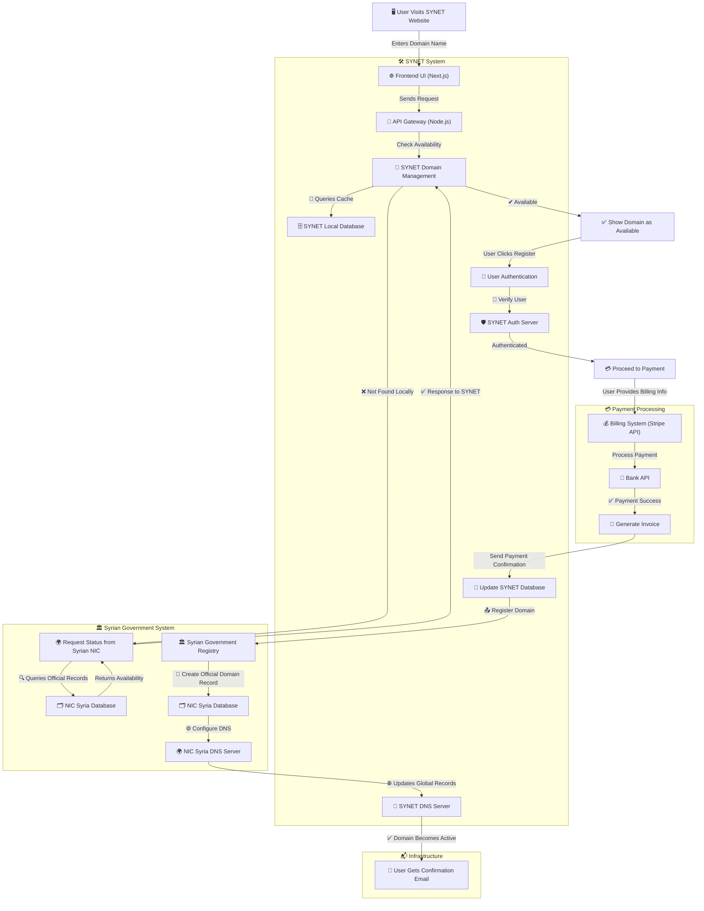

### 2.2. Domain Management System

The Domain Management System is responsible for handling domain availability checks, user authentication, and domain registration. It interacts with the Syrian NIC database to check domain availability and register domains. It also interacts with the SYNET database to store domain registration information.

