### 1. Domain Management System

The Domain Management System is responsible for handling domain availability checks, user authentication, and domain registration. It interacts with the Syrian NIC database to check domain availability and register domains. It also interacts with the SYNET database to store domain registration information.

```mermaid
graph TD;
    %% User Interaction
    A1["🖥️ User Visits SYNET Website"] -->|Enters Domain Name| A2["🌐 Frontend UI (Next.js)"];
    A2 -->|Sends Request| A3["🔀 API Gateway (Node.js)"];

    %% Domain Management System
    A3 -->|Check Availability| B1["📄 SYNET Domain Management"];
    B1 -->|🔎 Queries Cache| B2["🗄️ SYNET Local Database"];
    B1 -- "❌ Not Found Locally" --> C1["🌍 Request Status from Syrian NIC"];
    
    C1 -->|🔍 Queries Official Records| C2["🗂️ NIC Syria Database"];
    C2 -->|Returns Availability| C1;
    C1 -->|✅ Response to SYNET| B1;
    B1 -- "✔ Available" --> C3["✅ Show Domain as Available"];

    %% User Proceeds to Register
    C3 -->|User Clicks Register| D1["🔐 User Authentication"];
    D1 -->|🔑 Verify User| D2["🛡️ SYNET Auth Server"];
    D2 -->|Authenticated| D3["💳 Proceed to Payment"];

    %% Domain Registration Finalization
    D3 -->|User Provides Billing Info| E1["💰 Billing System (Stripe API)"];
    E1 -->|Process Payment| E2["🏦 Bank API"];
    E2 -->|✅ Payment Success| F1["🧾 Generate Invoice"];

    F1 -->|Send Payment Confirmation| G1["📄 Update SYNET Database"];
    G1 -->|📤 Register Domain| G2["🏛️ Syrian Government Registry"];
    G2 -->|📜 Create Official Domain Record| G3["🗂️ NIC Syria Database"];
    G3 -->|⚙️ Configure DNS| H1["🌍 NIC Syria DNS Server"];
    H1 -->|🌐 Updates Global Records| H2["🔗 SYNET DNS Server"];
    H2 -->|✅ Domain Becomes Active| I1["📩 User Gets Confirmation Email"];

    %% System Components
    subgraph "🛠️ SYNET System"
        A2;
        A3;
        B1;
        B2;
        D1;
        D2;
        G1;
        H2;
    end

    subgraph "🏛️ Syrian Government System"
        C1;
        C2;
        G2;
        G3;
        H1;
    end

    subgraph "💳 Payment Processing"
        E1;
        E2;
        F1;
    end

    subgraph "📬 Infrastructure"
        I1;
    end

```

### 2. SY gov system 

The Syrian government system is responsible for maintaining the official domain records and DNS configuration. It interacts with the NIC Syria database to create official domain records and the NIC Syria DNS server to configure DNS settings.

```mermaid
graph TD;

    %% 🟢 User Interaction
    A1["User 👤"] --> A2["SYNET Frontend 💻 (Next.js)"]
    A2 --> A3["SYNET API Gateway 🌍"]
    A3 --> A4["SYNET Domain Database 🗄"]

    %% 🔄 If domain is not found locally, query NIC Syria
    A3 -- "Not Found ❌" --> B1["NIC Syria Registry 🏛"]
    B1 --> B2["NIC Registry Database 📜"]
    B2 --> B1
    B1 --> A3

    %% 📝 User Proceeds to Register Domain
    A2 --> A5["SYNET Auth Server 🔐"]
    A2 --> A6["SYNET Payment Processor 💰"]
    A6 --> A7["SYNET Invoice Generator 📄"]

    %% 📩 SYNET Requests NIC Syria for Registration
    A3 --> B1
    B1 --> B3["NIC Admin Review Team 📝"]
    
    %% ✅ Domain Registration Approval Flow
    B3 -- "Approved ✔️" --> B4["NIC Payment System 🏦"]
    B4 --> B5["Payment Confirmed 📜"]
    B5 --> B2
    B2 --> B6["NIC DNS Servers 🌍"]
    B2 --> B7["NIC Backup Servers 📀"]

    %% ❌ Alternative Rejection Flow
    B3 -- "Rejected ❌" --> A3
    A3 --> A2
```	

